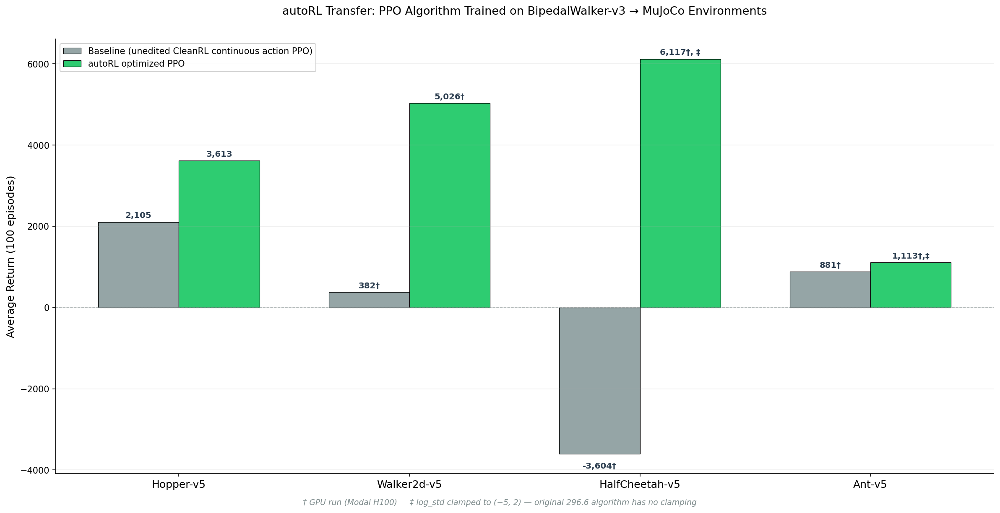

# autoRL

**Autoresearch for reinforcement learning.** Give it any RL environment, go to sleep, wake up to an optimized PPO algorithm.




Give an AI agent a RL training setup and let it experiment autonomously overnight. It modifies `train.py`, runs a 12 minute rollout, checks if `avg_return` improved, keeps or reverts, and repeats. You program the research direction in `program.md` — a Markdown file, not Python. This is a fork of [@karpathy's autoresearch](https://github.com/karpathy/autoresearch), adapted for reinforcement learning.

## How it works

Three files matter:

- **`evaluate.py`** — fixed constants (`TIME_BUDGET=720s`, `ENV_ID`, `NUM_EVAL_EPISODES=100`), environment factory, and evaluation harness. Never modified.
- **`train.py`** — single-file PPO implementation. The agent edits this freely: architecture, hyperparameters, normalization, batch size, anything.
- **`program.md`** — the research org spec. This is what the human edits to define the experiment protocol and point the agent in the right direction.

The agent creates a git branch, runs a baseline, then loops: edit `train.py` → commit → train 12 min → grep `avg_return` → keep or revert. Results are logged to a `results.tsv` on the branch. Originally built for BipedalWalker-v3 (Box2D), the optimized algorithm transfers strongly to MuJoCo environments (Hopper-v5, Walker2d-v5, HalfCheetah-v5, Ant-v5).

## Quick start

**Requirements:** Python 3.10+, [uv](https://docs.astral.sh/uv/), `swig` (Box2D). For MuJoCo environments, MuJoCo must also be installed.

```bash
# Install swig
brew install swig           # macOS
# sudo apt install swig     # Linux

# Install uv (if needed)
curl -LsSf https://astral.sh/uv/install.sh | sh

# Install dependencies
uv sync

# Run a single experiment (~12 min)
uv run python train.py
```

If this completes and prints `avg_return`, your setup is ready for autonomous research mode.

## Running the agent

Open Claude Code (or any coding agent) in this repo and prompt:

```
Have a look at program.md and let's kick off a new experiment!
```

The agent will create a branch, run the baseline, and iterate. At ~5 experiments/hour, an overnight session yields 30–40 experiments. To target a different environment, change `ENV_ID` in `evaluate.py` (e.g. `"Hopper-v5"`).

## Project structure

```
evaluate.py        — constants, environment factory, eval harness (do not modify)
train.py           — PPO agent + training loop (agent modifies this)
program.md         — agent instructions / research org spec (human modifies this)
modal_app.py       — Modal wrapper for running experiments on cloud H100s
pyproject.toml     — dependencies
results_*.tsv      — experiment logs per environment (generated by agent)
```

## Design choices

- **Single file to modify.** The agent only touches `train.py`. Diffs are reviewable, the evaluation harness can't be gamed, and the scope stays manageable.
- **Fixed time budget.** 12 minutes per rollout to balance enough time steps and experiments for an overnight session. Experiments are directly comparable regardless of what the agent changes — but absolute `avg_return` numbers are platform-specific. Relative improvement from baseline is always meaningful.
- **Keep-or-revert loop.** The branch tip always represents the best algorithm found so far. The git log is a clean record of what worked.
- **Self-contained.** No distributed training, no config files, no experiment trackers. One process, one file, one metric.

## Platform support

**CPU (macOS / Linux):** Runs out of the box. The original BipedalWalker experiments were run entirely on CPU.

**GPU (local):** No code changes needed — the training script auto-detects CUDA. More gradient steps per 12-minute budget means higher `avg_return`.

**GPU (Modal cloud):** `modal_app.py` runs experiments on an H100 via [Modal](https://modal.com). The image includes both Box2D and MuJoCo dependencies.

```bash
modal run modal_app.py
```

Requires a Modal account and `modal` (already in `pyproject.toml`).

## Future work

Right now PPO is the RL algorithm of choice. In the future, the agent should be able to iterate on the choice of algo as well. Many envs require extended rollouts to achieve optimal performance. 12-minute rollouts suffer from short horizon bias and may not generalize to longer training runs. Instead of using "solved" RL envs, the next step is to feed it "unsolved" tasks.

## Acknowledgements

- **[autoresearch](https://github.com/karpathy/autoresearch)** by @karpathy — this project is a direct fork, adapted from LLM pretraining to reinforcement learning. The core idea of programming a Markdown research org spec comes entirely from there.
- **[CleanRL](https://github.com/vwxyzjn/cleanrl)** — the PPO implementation in `train.py` is based on CleanRL's single-file `ppo_continuous_action.py`. Their philosophy of readable, single-file RL implementations is exactly what makes this setup work.

## License

MIT
