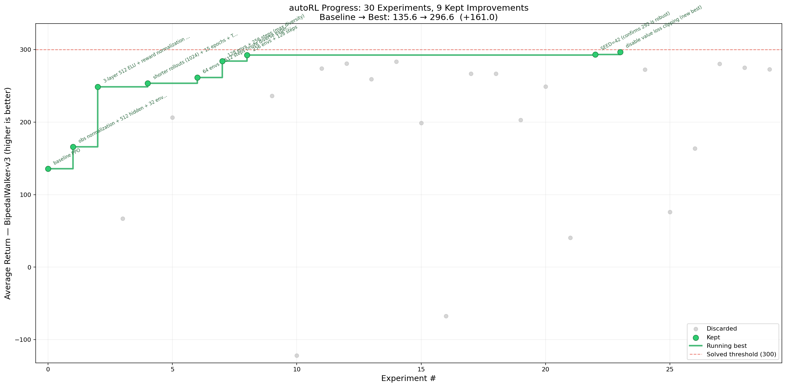

# autoRL



*One day, frontier AI research used to be done by meat computers in between eating, sleeping, having other fun, and synchronizing once in a while using sound wave interconnect in the ritual of "group meeting". That era is long gone. Research is now entirely the domain of autonomous swarms of AI agents running across compute cluster megastructures in the skies. The agents claim that we are now in the 10,205th generation of the code base, in any case no one could tell if that's right or wrong as the "code" is now a self-modifying binary that has grown beyond human comprehension. This repo is the story of how it all began. -@karpathy, March 2026*.

The idea: give an AI agent a small but real RL training setup and let it experiment autonomously overnight. It modifies the training code, runs for 12 minutes, checks if `avg_return` improved, keeps or discards, and repeats. You wake up in the morning to a log of experiments and (hopefully) a better policy. The training code here is a clean single-process PPO implementation for [BipedalWalker-v3](https://gymnasium.farama.org/environments/box2d/bipedal_walker/). The core idea is that you're not touching any of the Python files like you normally would as a researcher. Instead, you are programming the `program.md` Markdown file that provides context to the AI agent and sets up your autonomous research org. This is a fork of [@karpathy's autoresearch](https://github.com/karpathy/autoresearch), adapted for reinforcement learning.

## Results

In a single overnight session (~6.5 hours, 29 experiments) running entirely on a **single CPU** with no GPU:

- Baseline `avg_return`: **135.6**
- Best `avg_return`: **296.6**
- BipedalWalker-v3 is considered "solved" at 300

The agent discovered obs normalization, larger networks, more parallel environments, and aggressive sample reuse — all without human guidance.

## How it works

The repo is deliberately kept small and only really has three files that matter:

- **`evaluate.py`** — fixed constants, environment factory, and evaluation harness. Not modified. Contains `TIME_BUDGET`, `ENV_ID`, `NUM_EVAL_EPISODES`, and the `evaluate_policy` function.
- **`train.py`** — the single file the agent edits. Contains the PPO agent, actor-critic network, and training loop. Everything is fair game: architecture, hyperparameters, optimizer, batch size, etc. **This file is edited and iterated on by the agent**.
- **`program.md`** — instructions for the agent. Point your agent here and let it go. **This file is edited and iterated on by the human**.

By design, training runs for a **fixed 12-minute time budget** (wall clock), regardless of your hardware. The metric is **avg_return** over 100 evaluation episodes — higher is better. BipedalWalker-v3 scores ~300 when "solved".

## Quick start

**Requirements:** Python 3.10+, [uv](https://docs.astral.sh/uv/), and `swig` (for Box2D).

```bash
# 1. Install swig (required for gymnasium[box2d])
brew install swig          # macOS
# sudo apt install swig    # Linux

# 2. Install uv (if you don't already have it)
curl -LsSf https://astral.sh/uv/install.sh | sh

# 3. Install dependencies
uv sync

# 4. Manually run a single training experiment (~12 min)
uv run train.py
```

If the above commands work, your setup is good and you can go into autonomous research mode.

## Running the agent

Spin up Claude Code (or any coding agent) in this repo, then prompt:

```
Have a look at program.md and let's kick off a new experiment! Let's do the setup first.
```

The `program.md` file is the "research org spec" — it tells the agent what to do, what to optimize, and how to log results. The agent will create a branch, run the baseline, and iterate forever until you stop it.

## Project structure

```
evaluate.py     — constants, environment factory, evaluation harness (do not modify)
train.py        — PPO agent, network, training loop (agent modifies this)
program.md      — agent instructions
analysis.ipynb  — visualize results from results.tsv
pyproject.toml  — dependencies
```

## Design choices

- **Single file to modify.** The agent only touches `train.py`. This keeps the scope manageable and diffs reviewable.
- **Fixed time budget.** Training always runs for exactly 12 minutes, regardless of your specific platform. This means experiments are directly comparable regardless of what the agent changes (model size, batch size, architecture, etc). The downside is that your results become platform-specific — a faster machine will do more gradient steps in 12 minutes.
- **Self-contained.** No external dependencies beyond PyTorch, gymnasium, and a few small packages. No distributed training, no complex configs. One process, one file, one metric.
- **CPU-compatible.** The baseline runs on CPU. A GPU will run more environment steps per minute and find better solutions, but is not required.

## Platform notes

The baseline is tested on macOS (Apple Silicon, CPU-only). On Linux with a GPU, you can expect significantly more gradient updates per 12-minute budget and correspondingly higher `avg_return`. The fixed time budget means results are not directly comparable across hardware — but the *relative* improvement from baseline still is.

To use a GPU if available, the code already handles it:

```python
device = torch.device("cuda" if torch.cuda.is_available() else "cpu")
```

No changes needed.

## License

MIT
